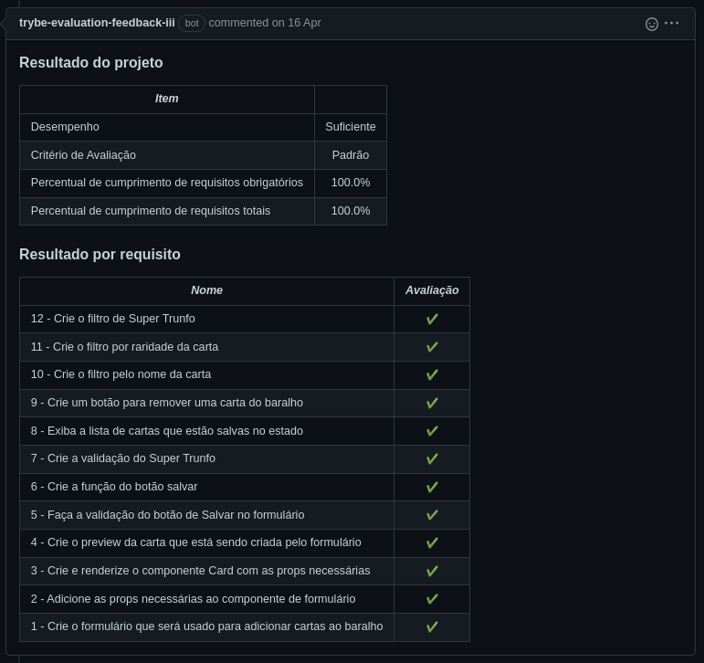
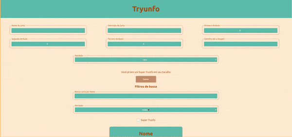

# Português 🇧🇷🇵🇹

<details>
  <summary>
    Saiba mais
  </summary>
  
  # Tryunfo
Projeto da [Trybe](https://www.betrybe.com/) - Bloco 11 - Aplicação de jogo Super Trunfo feita com React.

## 💻 Projeto

Jogo estilo Super Trunfo, em que a pessoa usuário é capaz de:

- Criar um baralho;
- Adicionar e remover uma carta do baralho;
- Visualizar e filtrar todas as cartas que foram adicionadas ao baralho;
- Jogar com o baralho criado.

<details>
  <summary><strong>🏆 Meu desempenho</strong></summary><br />

  
</details>
  
<details>
  <summary><strong>🖼️ Gif do projeto</strong></summary><br />

  
</details>

## 🚀 Tecnologias
> Este projeto foi desenvolvido com:

- JavaScript
- React
- CSS

## 📌 Habilidades
> Habilidades desenvolvidas:

- Ler o estado de um componente e usá-lo para alterar o que é exibido no browser;
- Inicializar um componente, dando a ele um estado pré-definido;
- Atualizar o estado de um componente;
- Criar formulários e capturar eventos utilizando a sintaxe do React;
- Transmitir informações de componentes filhos para componentes pais via callbacks.

## ⬇️ Instalando dependências

```bash
npm install
``` 

## ⚡ Executando App

```bash
npm start
```
  
## Time de desenvolvimento
> Projeto individual:
  

## 💬 Contatos

<div align="center" style="display: inline_block">
  <a href="https://rabeloguedes.github.io" target="_blank">
    
  </a> 
  <a href="https://www.linkedin.com/in/al%C3%AA-emmanuel-rabelo-guedes/" target="_blank">
    
  </a> 
   <a href="mailto:rabeloguedes@proton.me">
     
  </a>
</div>

</details>

# English 🇺🇸🇬🇧

<details>
  <summary>
    More
  </summary>
  
  # Tryunfo
Project from [Trybe](https://www.betrybe.com/) - Block 11 - React application of Super Trunfo game made with React.

## 💻 Project

Game style Super Trunfo, where the user is able to:

    - Create a deck;
    - Add and remove a card from the deck;
    - View and filter all the cards that were added to the deck;
    - Play with the deck created.

<details>
  <summary><strong>🏆 My accomplishment</strong></summary><br />

  
</details>
  
<details>
  <summary><strong>🖼️ Project's Gif</strong></summary><br />

  

</details>

## 🚀 Technologies
> This project was developed with:

- JavaScript
- React
- CSS

## 📌 Skills
> Practiced skills:

- Read the state of a component and use it to change what is displayed in the browser;
- Initialize a component, giving it a pre-defined state;
- Update the state of a component;
- Create forms and capture events using the syntax of React;
- Transmit information from children to parents via callbacks.

 ## ⬇️ Install dependencies

```bash
npm install
``` 

## ⚡ Execute App

```bash
npm start
```

## Squad
> Single Person Project:
  

## 💬 Contact

<div align="center" style="display: inline_block">
  <a href="https://rabeloguedes.github.io" target="_blank">
    
  </a> 
  <a href="https://www.linkedin.com/in/al%C3%AA-emmanuel-rabelo-guedes/" target="_blank">
    
  </a> 
   <a href="mailto:rabeloguedes@proton.me">
     
  </a>
</div>

</details>

# Deutsch 🇩🇪

<details>
  <summary>
    Mehr
  </summary>
  
  # Tryunfo
Projekt von [Trybe](https://www.betrybe.com/) - Block 11 - React-Applikation des Super-Trunfo-Spiels gemacht mit React.

## 💻 Projekt

Super Trunfo Spiel, in dem der Benutzer die folgenden Funktionen nutzen kann:

    - Kartenset erstellen;
    - Karten aus dem Kartenset entfernen;
    - Alle Karten aus dem Kartenset anzeigen;
    - Mit dem Kartenset spielen.

<details>
  <summary><strong>🏆 Meine Leistung</strong></summary><br />

  
</details>
  
<details>
  <summary><strong>🖼️ Projekts Gif</strong></summary><br />

  
</details>

## 🚀 Technologies
> Dieses Projekt wurde mit den entsprechenden Technologies hergestellt:

- JavaScript
- React
- CSS

## 📌 Fähigkeiten
> Ausgeübte Fähigkeiten:

- Auslesen des States eines Components und dessen Veränderung in der Browseranzeige;
- Initialisieren einen Component, der einen vordefinierten State erhält;
- Aktualisieren des States eines Components;
- Erstellen von Formularen und der Erfassung von Events mittels der Syntax von React;
- Transmitieren von Informationen von Kindkomponenten zu Eltern über Callbacks.

## ⬇️ Installieren dependencies

```bash
npm install
``` 

## ⚡ App Ausführung

```bash
npm start
```
  
## Entwickungsteam
> Einer Person Projekt:
  

## 💬 Kontakt

<div align="center" style="display: inline_block">
  <a href="https://rabeloguedes.github.io" target="_blank">
    
  </a> 
  <a href="https://www.linkedin.com/in/al%C3%AA-emmanuel-rabelo-guedes/" target="_blank">
    
  </a> 
   <a href="mailto:rabeloguedes@proton.me">
     
  </a>
</div>

</details>
